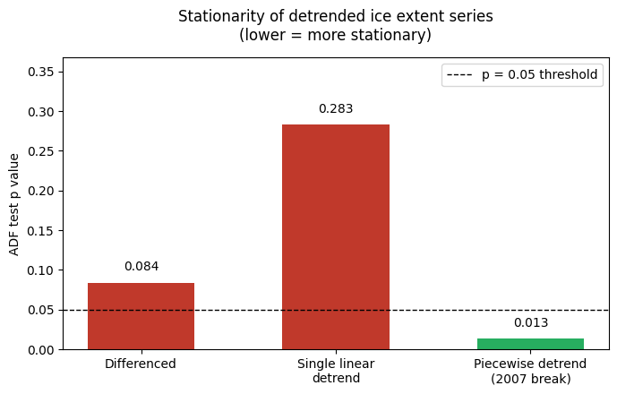
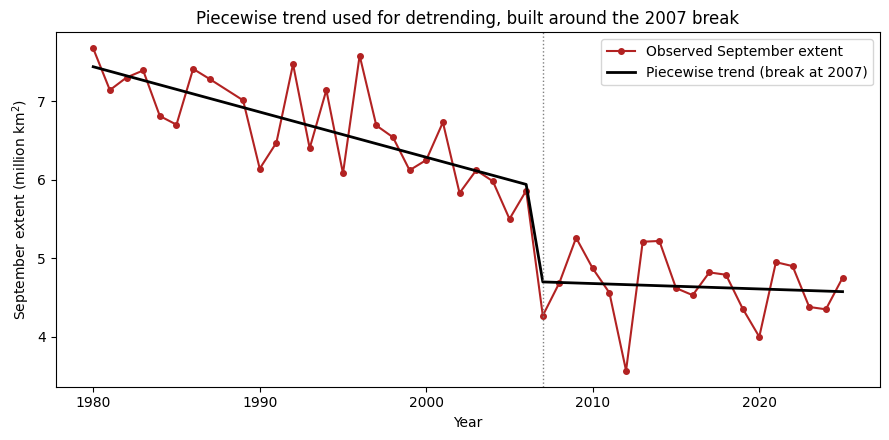
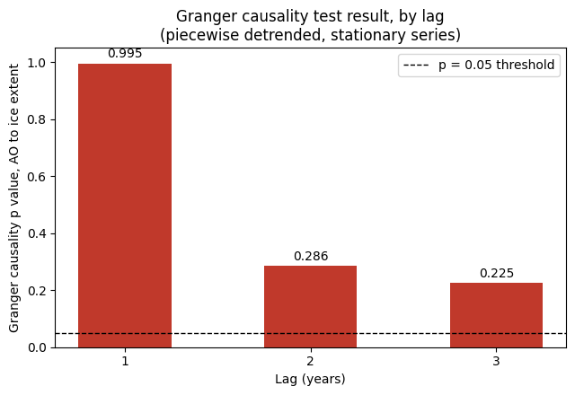

# Granger Causality Check: Winter AO and September Sea Ice Extent

**An extension of [Arctic-Sea-Ice-AO-Prediction](https://github.com/Shweta-Portfolio/Arctic-Sea-Ice-AO-Prediction), rechecking that project's central claim with a different, more standard method.**

## Overview

The AO project used Ridge regression and a permutation test to argue that winter
Arctic Oscillation carries real predictive information about September sea ice extent. This notebook asks the same question with Granger causality, the older and more standard tool for exactly this kind of claim, run properly rather than as a quick sanity check.

Doing this surfaced a second question along the way. Granger causality requires a stationary target series, and September ice extent is not stationary on its own. Fixing that turned into a small, self-contained test of the 2007 structural break already identified in [Arctic-Sea-Ice-Trend-Break](https://github.com/Shweta-Portfolio/Arctic-Sea-Ice-Trend-Break), from a completely different angle than the one used there.

## Data

Same dataset as the AO project. NOAA sea ice extent and AO index, 1980 to 2025, 45 rows, one row per winter. Two columns are used here: `winter_AO_mean` and `target_sept_extent`.

## Method

1. **Stationarity check** on both raw series (ADF test)
2. **Three ways of making ice extent stationary**, compared directly: first differencing, a single linear detrend, and a piecewise linear detrend built around the 2007 break already established in the Trend-Break project
3. **Granger causality test** (AO → ice extent, lags 1 to 3) run on the differenced series first, then rerun on whichever detrended version proved most stationary

## Results

### Winter AO is already stationary. September ice extent is not.

| Series | ADF p-value | Stationary? |
|---|---|---|
| `winter_AO_mean` | 0.000 | Yes |
| `target_sept_extent` (raw) | 0.835 | No |

### Of three ways to fix that, only the break-aware one actually works

| Detrending method | ADF p-value | Stationary? |
|---|---|---|
| First differencing | 0.084 | Borderline, no |
| Single linear detrend | 0.283 | No |
| Piecewise detrend (2007 break) | **0.013** | **Yes** |



A single straight line detrends worse than doing nothing structural at all (differencing). That is not noise. It is a second, independent confirmation of the 2007 break, arrived at through a stationarity test rather than the changepoint search that first found it in the Trend-Break project.



### Granger causality, run on the one properly stationary version, finds no link

| Lag (years) | p-value |
|---|---|
| 1 | 0.995 |
| 2 | 0.286 |
| 3 | 0.225 |



At every lag tested, winter AO's past does not significantly improve the prediction of September ice extent beyond what ice extent's own history already gives. The result is the same whether tested on the differenced series or the piecewise-detrended one.

## Interpretation

This result differs from the AO project's own conclusion, where a permutation test
found AO's contribution unlikely to be due to chance. That difference was checked
directly rather than left unresolved.

The AO project's own method, Ridge regression with persistence as a control and a
permutation test, was rerun here using the corrected, properly stationary target
this notebook builds. AO's contribution stayed significant, p = 0.026, meaning the
original finding was not an artifact of the non stationary target Granger
causality flagged. The disagreement instead comes from what each method actually
tests. Granger causality asks whether AO's own past predicts ice extent on its
own. The AO project's method asks whether AO adds anything once persistence is
already accounted for. AO does not help much alone, but does help a little
alongside persistence, and both of those things are true at once.


## Limitations

- 45 annual observations constrains every test here in the same way it constrains the other three projects in this series
- Granger causality as applied is linear; a nonlinear variant was not tested
- The 2007 break year is taken from the Trend-Break project rather than re-searched here, so this result depends on that project's break-point estimate being correct
- The permutation-based reconciliation checks whether AO's significance survives on a corrected target, but does not test every possible explanation for method differences between Granger causality and Ridge regression with persistence

## Reproducing

```
pip install pandas numpy matplotlib statsmodels
```

Data is pulled directly from the AO project's own repository, so no separate download step is needed. Run the notebook top to bottom.
